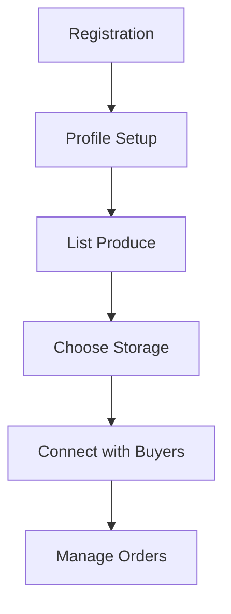
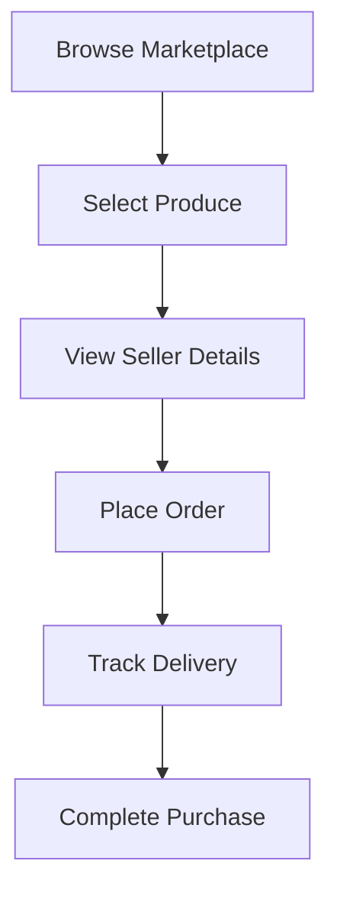

# AgriVault - Agro Marketplace & Smart Storage Platform

<div align="center">
  
  
  <h3>Connecting Nigerian Farmers with Buyers Through Smart Storage Solutions</h3>
  
  [](https://opensource.org/licenses/MIT)
  [](https://reactjs.org/)
  [](https://www.typescriptlang.org/)
  [](https://vitejs.dev/)
</div>

## 🌱 About AgriVault

AgriVault is a comprehensive e-commerce marketplace designed specifically for Nigerian smallholder farmers and agro buyers. The platform addresses critical challenges in the agricultural value chain:

- **Limited Market Access**: Direct connection between farmers and verified buyers
- **Unfair Pricing**: Transparent pricing mechanisms and market information
- **Post-Harvest Losses**: Integrated storage solutions with climate-controlled facilities
- **Digital Inclusion**: Multi-platform access through web, mobile, and USSD/SMS

## ✨ Key Features

### For Farmers
- 🏪 **Store & List Produce**: Secure storage with marketplace integration
- 💰 **Fair Pricing**: Direct access to buyers eliminates middlemen
- 📊 **Dashboard Analytics**: Track earnings, storage status, and sales history
- 📱 **Multi-Platform Access**: Web, mobile, and USSD compatibility

### For Buyers
- 🛒 **Fresh Produce**: Direct access to quality produce from verified farmers
- 🔍 **Transparent Sourcing**: Complete seller information and ratings
- 📦 **Order Tracking**: Real-time delivery status and updates
- 💳 **Secure Transactions**: Safe payment processing and order management

### Technical Features
- 🔄 **Offline Support**: Core functionality available without internet
- 📲 **PWA Ready**: Installable on mobile devices with app-like experience
- 🌐 **Responsive Design**: Optimized for desktop, tablet, and mobile
- ⚡ **Performance Optimized**: Fast loading and smooth interactions

## 🚀 Quick Start

### Prerequisites
- Node.js (v18 or higher)
- npm or yarn package manager

### Installation

```bash
# Clone the repository using the project's Git URL.
git clone <YOUR_GIT_URL>

# Navigate to the project directory.
cd <YOUR_PROJECT_NAME>

# Install the necessary dependencies.
npm i

# Start the development server with auto-reloading and an instant preview.
npm run dev
```

### Environment Setup

Create a `.env` file in the root directory:

```env
VITE_SUPABASE_URL=your_supabase_project_url
VITE_SUPABASE_ANON_KEY=your_supabase_anon_key
```

## 🏗️ Technology Stack

### Frontend
- **React 18.3.1** - Modern React with hooks and concurrent features
- **TypeScript 5.8.3** - Type-safe JavaScript development
- **Vite 5.4.19** - Fast build tool and development server
- **Tailwind CSS 3.4.17** - Utility-first CSS framework
- **shadcn/ui** - Modern React component library

### Backend & Database
- **Supabase** - Backend-as-a-Service providing PostgreSQL, Auth, and Real-time
- **Dummy Client** - Local development fallback with mock data

### State Management & Data Fetching
- **TanStack Query 5.83.0** - Server state management and caching
- **React Hook Form 7.61.1** - Form state management with validation

## 📱 User Flows

### Farmer Journey


### Buyer Journey


## 🗄️ Database Schema

### Core Tables
- **Profiles**: User information for farmers and buyers
- **Produce Listings**: Available produce with pricing and availability
- **Storage Facilities**: Storage locations with capacity and pricing
- **Orders**: Transaction records and delivery tracking
- **Storage Bookings**: Storage reservations and management

## 🌐 Progressive Web App Features

### Offline Support
- **Offline Queue**: Actions performed offline sync when connectivity returns
- **Local Caching**: Intelligent data caching for offline access
- **Connection Status**: Visual indicators for online/offline state

### PWA Configuration
- **Installable**: Add to home screen on mobile devices
- **Background Sync**: Automatic data synchronization
- **Push Notifications**: Order updates and important alerts

## 📂 Project Structure

```
src/
├── components/          # Reusable UI components
│   ├── ui/             # Base UI components (shadcn/ui)
│   ├── Features.tsx    # Feature showcase
│   ├── Hero.tsx       # Landing page hero section
│   └── ...
├── pages/              # Route-level components
│   ├── Index.tsx      # Landing page
│   ├── FarmersDashboard.tsx
│   ├── BuyerDashboard.tsx
│   ├── Marketplace.tsx
│   └── ...
├── integrations/       # External service integrations
│   ├── supabase/      # Supabase client and types
│   └── dummy/         # Mock data service
├── lib/               # Utility functions
│   ├── offline.ts     # Offline support utilities
│   └── utils.ts       # General utilities
└── hooks/             # Custom React hooks
```

## 🚀 Deployment

### Build Process
```bash
npm run build
```

### Deployment Options
- **Vercel** (Recommended): `vercel --prod`
- **Netlify**: `netlify deploy --prod --dir=dist`
- **GitHub Pages**: Configure GitHub Actions for auto-deployment
- **AWS Amplify**: Connect repository for automated deployment

## 🔧 Development Scripts

```bash
npm run dev          # Start development server
npm run build        # Build for production
npm run build:dev    # Build for development environment
npm run preview      # Preview production build locally
npm run lint         # Run ESLint for code quality checks
```

## 📋 Available Scripts

- `npm run dev` - Start development server with hot reload
- `npm run build` - Build for production
- `npm run build:dev` - Build for development environment
- `npm run preview` - Preview production build locally
- `npm run lint` - Run ESLint for code quality checks

## 🤝 Contributing

1. Fork the repository
2. Create a feature branch (`git checkout -b feature/AmazingFeature`)
3. Commit your changes (`git commit -m 'Add some AmazingFeature'`)
4. Push to the branch (`git push origin feature/AmazingFeature`)
5. Open a Pull Request

## 📄 License

This project is licensed under the MIT License - see the [LICENSE](LICENSE) file for details.

## 🔮 Future Enhancements

### Planned Features
- 📞 **USSD/SMS Integration**: Full feature phone support
- 📱 **Mobile Applications**: React Native apps for iOS and Android
- 💳 **Payment Integration**: Mobile money and escrow systems
- 🚚 **Logistics Network**: Transportation provider integration
- 📊 **Advanced Analytics**: Market trends and performance insights

### Technical Improvements
- 🔒 **Security Enhancements**: Two-factor authentication and fraud detection
- ⚡ **Performance Optimization**: Advanced caching and bundle optimization
- 🌐 **Scalability**: Microservices architecture and load balancing

## 📞 Support


<div align="center">
  <p>Made with ❤️ </p>
  <p>© 2025 AgriVault. All rights reserved.</p>
</div>
